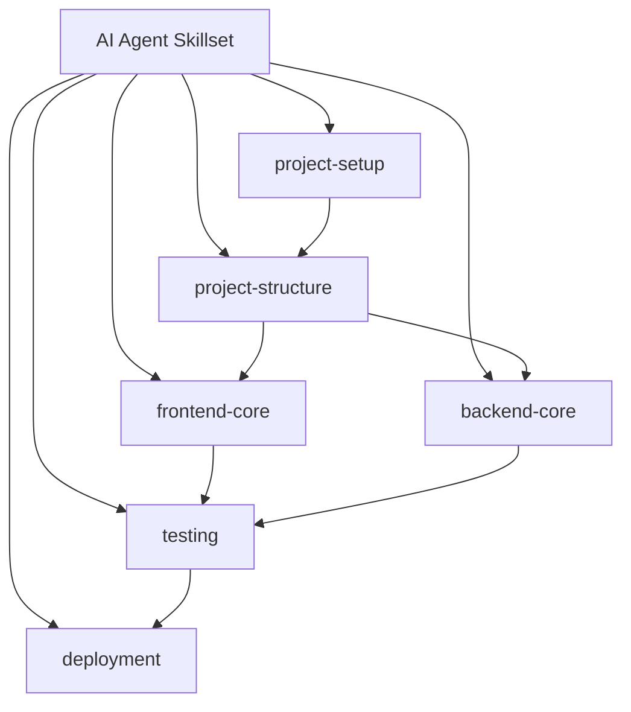
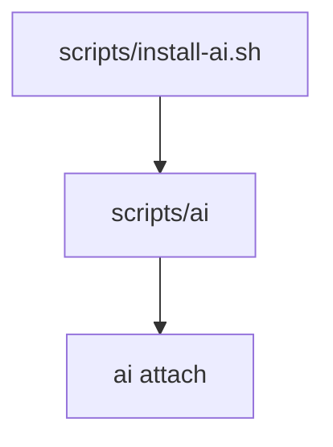

# Phase 1 — Problem & Proposal

## Problem
Define consistent AI agent guidelines/workflows for full‑stack app tasks (frontend, backend, project setup, and project structure) using `SKILL.md` format.

## Proposal (initial skill set to draft)
Create a small, reviewable set of core skills as a starting point:

1. **project-setup** — bootstrap new project (tooling, env, scripts, lint/format/test).
2. **project-structure** — recommend and enforce clean repo layout and module boundaries.
3. **frontend-core** — UI scaffolding, routing, state, data fetching, components.
4. **backend-core** — API design, DB access patterns, auth, error handling.
5. **testing** — unit/integration/e2e test setup and practices across stack.
6. **deployment** — build, CI/CD, environment config, release checklist.

## Scope notes
- Keep each skill minimal and focused; avoid overlap via clear “when to use” descriptions.
- Store each skill at `skills/<skill-name>/SKILL.md` with optional `references/` for deeper guidance.

If this direction looks good, I’ll move to Phase 2 and produce the blueprint (BML + Mermaid + reuse/new justification).

# Phase 2 — Blueprint Planning

## BML

```bml
node Skill:project-setup
  components:
    - SKILL.md
  references:
    - references/tooling.md
    - references/env.md
    - references/ci.md
  hooks:
    - preflight-checks
  types:
    - SetupChecklist
  api_clients:
    - none
```

```bml
node Skill:project-structure
  components:
    - SKILL.md
  references:
    - references/structure-guidelines.md
    - references/module-boundaries.md
  hooks:
    - structure-audit
  types:
    - StructureMap
  api_clients:
    - none
```

```bml
node Skill:frontend-core
  components:
    - SKILL.md
  references:
    - references/frontend-routing.md
    - references/frontend-state.md
    - references/frontend-components.md
  hooks:
    - ui-review
    - data-fetching-review
  types:
    - FrontendChecklist
  api_clients:
    - none
```

```bml
node Skill:backend-core
  components:
    - SKILL.md
  references:
    - references/api-design.md
    - references/db-access.md
    - references/auth.md
  hooks:
    - api-review
    - auth-review
  types:
    - BackendChecklist
  api_clients:
    - none
```

```bml
node Skill:testing
  components:
    - SKILL.md
  references:
    - references/unit-testing.md
    - references/integration-testing.md
    - references/e2e-testing.md
  hooks:
    - test-gap-review
  types:
    - TestingMatrix
  api_clients:
    - none
```

```bml
node Skill:deployment
  components:
    - SKILL.md
  references:
    - references/build-release.md
    - references/ci-cd.md
    - references/env-config.md
  hooks:
    - release-checklist
  types:
    - ReleaseChecklist
  api_clients:
    - none
```

## Mermaid overview



## Reuse vs new (integration justification)
- No existing skills found in `skills/` beyond planning artifacts, so all listed skills are **new**.
- Each skill is intentionally narrow to keep diffs reviewable and avoid overlap.

If approved, I’ll implement the skills under `skills/<skill-name>/SKILL.md` with minimal, focused content and references as listed.

# Phase 1 — Problem & Proposal (Global attach script)

## Problem
Provide a command named `ai` that can be installed once and then run from any repo to symlink this repo’s skills/instructions into the target project.

## Proposal
Add a simple install script in `scripts/` that:

1. Installs a small wrapper command `ai` into a user bin path (default `~/.local/bin`).
2. The `ai` command supports `attach` to symlink:
   - `AGENTS.md` → target repo root
   - `.claude/skills` → this repo’s `skills/` folder
3. The `ai` command determines the source repo path from the install location (no config needed).

## Open decisions (confirm before Phase 2)
- Target bin location for install (`~/.local/bin` default OK?).
- Overwrite behavior if target already has `AGENTS.md` or `.claude/skills` (abort vs `--force`).
- Should `ai` take target folder as first argument and default to `.` only if omitted?
- Should confirmation be required by default, with `-y` to auto-confirm?

# Phase 2 — Blueprint Planning (Global attach script)

## BML

```bml
node Script:ai-install
  components:
    - scripts/install-ai.sh
  references:
    - none
  hooks:
    - none
  types:
    - none
  api_clients:
    - none
```

```bml
node Script:ai
  components:
    - scripts/ai
  references:
    - none
  hooks:
    - none
  types:
    - none
  api_clients:
    - none
```

## Mermaid overview



## Reuse vs new (integration justification)
- No existing script utilities for global install; add `scripts/install-ai.sh` and `scripts/ai` as **new**.

If approved, I’ll implement `scripts/install-ai.sh` and `scripts/ai` with the confirmed behavior.
